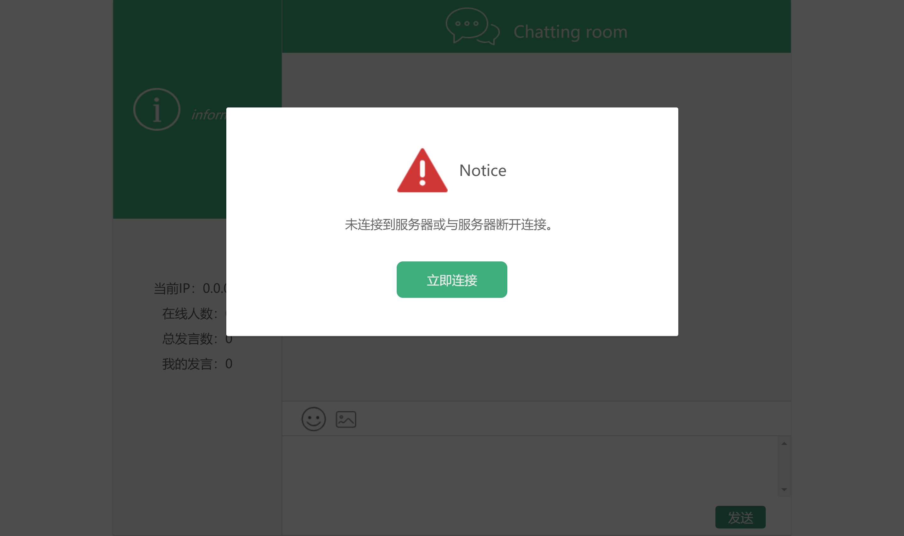
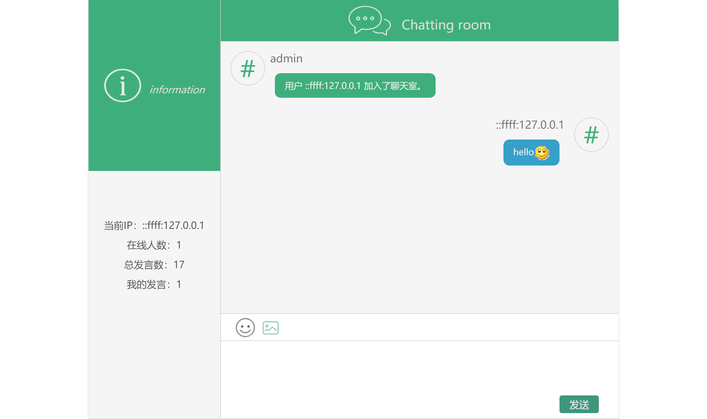
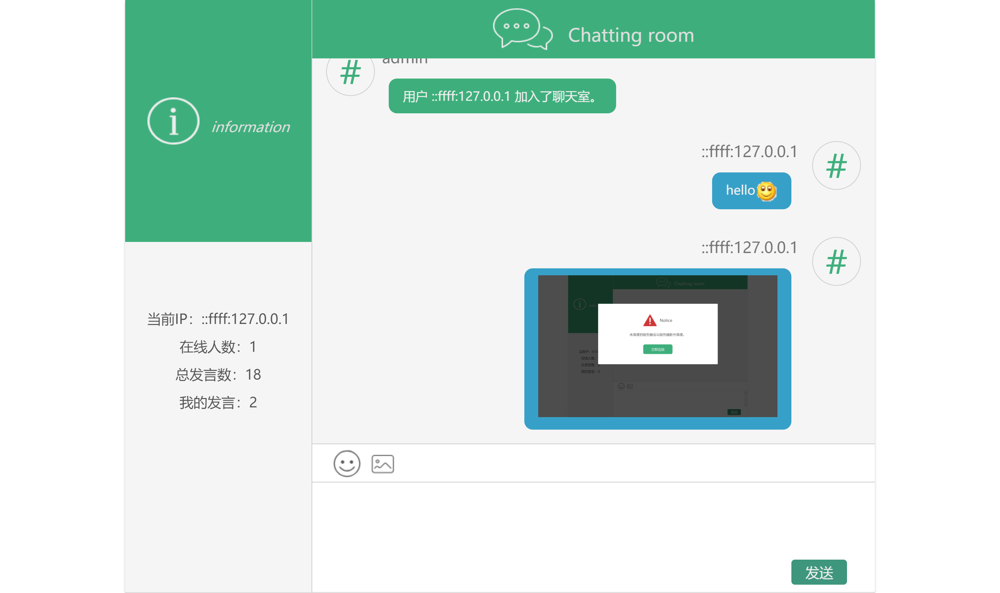

### 一个基于WebSocket + Vue + Node.js的多人聊天室
已实现：
```
1. 发送文字消息
2. 发送emoji表情
3. 发送图片
```
emoji表情面板组件emoji-picker可以单独拿出来使用。emoji表情源来自：https://res.wx.qq.com/mpres/htmledition/images/icon/emotion/表情编号.gif(编号0 - 104)
### 界面截图





### 运行方法
客户端：
```
cd /path/to/chatting-room
npm run dev
```

服务端：
```
cd /path/to/chatting-room/server
node index
```
浏览器打开`localhost:8080`查看效果